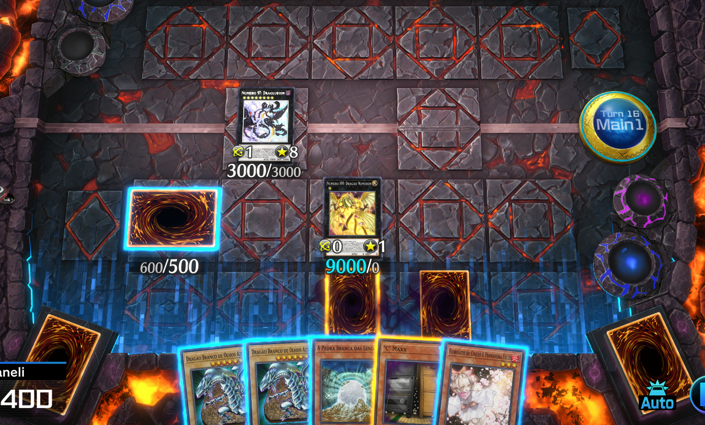
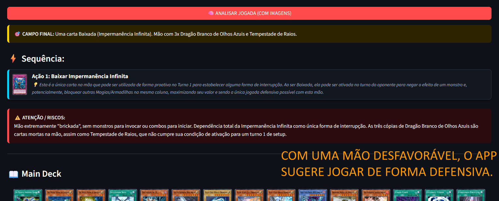
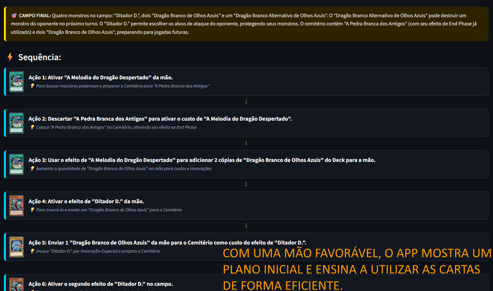
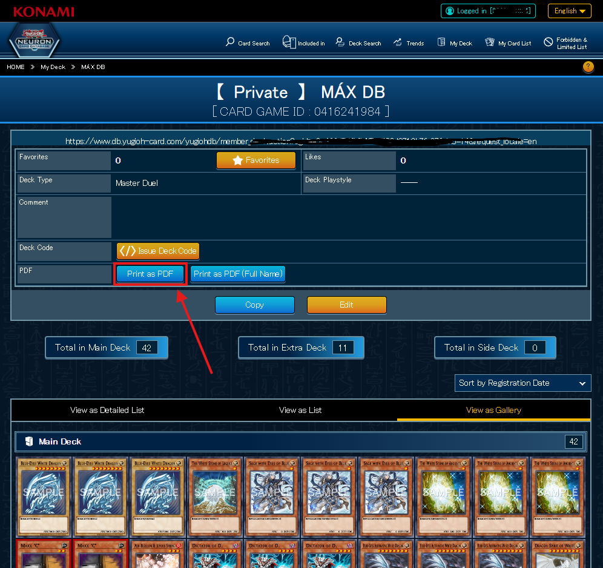
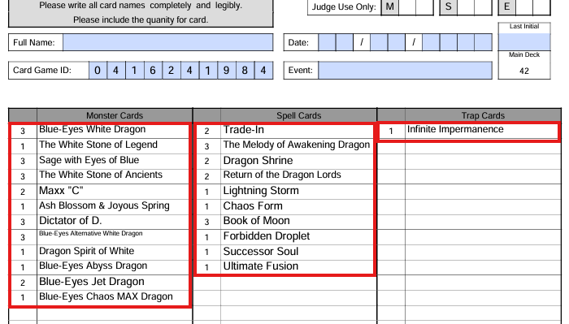
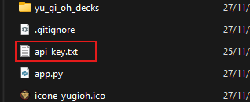
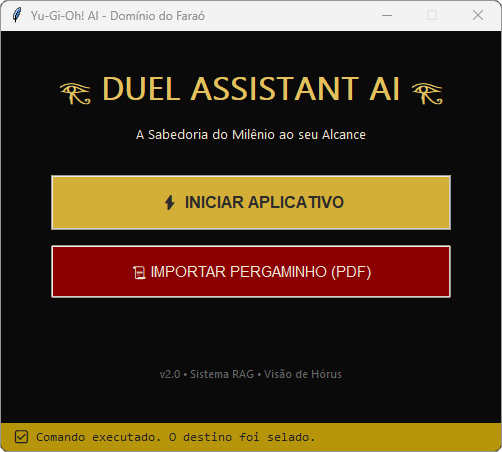

> ⚖️ **Aviso de Uso Ético (Fair Play):**
> Este software é uma ferramenta estritamente **educacional e analítica**. Seu objetivo é auxiliar iniciantes a compreenderem a mecânica de seus decks e aprenderem rotas de combo, servindo como um "tutor virtual".
>
> * **Não é um Bot:** O programa não interage com o cliente do jogo e não executa ações automáticas.
> * **Não é Cheat:** Ele não acessa dados ocultos nem altera a memória do jogo.
> * **Escopo:** A análise foca exclusivamente na **mão inicial (Turno 1)** para fins de estudo de consistência e estratégia.

# 🃏 Yu-Gi-Oh! Assistente de IA para Combos Iniciais (Multimodal RAG)

Um assistente tático inteligente para **Yu-Gi-Oh! Master Duel** que converte listas de decks em PDF para bancos de dados estruturados e utiliza LLMs avançadas para sugerir as melhores jogadas (combos) em tempo real baseadas na mão inicial.

<p align="center">
  
</p>

<p align="center">
  
</p>

## 💡 Sobre o Projeto

Este projeto resolve a complexidade de pilotar decks meta em *Yu-Gi-Oh! Master Duel*. Ele elimina a necessidade de entrada manual de dados, utilizando IA para ler arquivos exportados diretamente do jogo e criando um sistema de **RAG (Retrieval-Augmented Generation)** para fornecer conselhos estratégicos contextualizados.

### Análise de Cenários

<p align="center">
  
</p>
<p align="center">
  
</p>

### O Fluxo de Trabalho (Pipeline)

1. **Exportação:** O usuário exporta seu deck do jogo para o site oficial da Konami (*Yu-Gi-Oh! Card Database*) usando uma função presente no próprio jogo e baixa a lista em formato **.PDF**.

<p align="center"></p>

2. **Ingestão Inteligente (`importar_pdf.py`):**
   * Utiliza o modelo **Gemini 1.5 Pro** para ler e interpretar a estrutura do PDF.
   
   <p align="center"></p>
   
   * Cruza os dados com a API pública do *YGOPRODeck* para obter metadados e imagens em alta resolução.
   * Utiliza a biblioteca **Pillow** para processar as imagens, "carimbando" visualmente a quantidade de cópias (x1, x2, x3) diretamente no arquivo de imagem.
   * Gera um banco de dados local `.json` persistente.

   <p align="center"></p>

3. **Interface Tática (`app.py`):**
   * Interface visual interativa construída em **Streamlit** com design customizado (CSS).
   * Permite seleção visual da mão inicial e alternância dinâmica entre diferentes decks carregados.
   * Envia o contexto exato das cartas (efeitos e nomes) para o **Gemini 2.5 Flash**, que atua como um "Pro Player", retornando um fluxograma passo-a-passo da melhor jogada.

## 🛠️ Tecnologias e Bibliotecas

* **Google Generative AI:**
    * `gemini-1.5-pro`: Para análise estrutural de documentos (PDF) e extração de dados complexos.
    * `gemini-2.5-flash`: Para raciocínio lógico rápido e geração de estratégia de jogo.
* **Streamlit:** Frontend reativo com gerenciamento de estado (`session_state`) e componentes personalizados.
* **Pillow (PIL):** Manipulação programática de imagens para adicionar indicadores visuais de quantidade.
* **Requests & JSON:** Integração de APIs REST e manipulação de dados locais.

## 🚀 Instalação e Uso

### 1. Instalação das Dependências
Certifique-se de ter o Python instalado. Clone o repositório e instale as bibliotecas necessárias:

```bash
pip install google-generativeai streamlit st-clickable-images requests pillow
```

### 2. Configuração da Inteligência (API Key) 🔑
Este programa precisa de um "cérebro" para funcionar.
1.  Crie um arquivo de texto chamado `api_key.txt` na **pasta principal** do projeto (junto com o executável).
2.  Cole dentro dele apenas a sua chave de API do Google AI Studio.

<p align="center">

</p>

> **⚠️ Atenção aos Modelos de IA:**
> O código está configurado por padrão para usar os modelos **`gemini-1.5-pro`** (para ler PDFs) e **`gemini-2.5-flash`** (para estratégia).
> Se a sua chave de API não tiver permissão para esses modelos específicos (dependendo da região ou conta), você precisará abrir os arquivos `importar_pdf.py` e `app.py` e alterar o nome do modelo manualmente para uma versão compatível (ex: `gemini-pro`).

### 3. Preparando seu Deck 🎴
1.  Exporte a lista do seu deck no site oficial da Konami (*Yu-Gi-Oh! Card Database*) no formato **.PDF**.
2.  Salve esse arquivo PDF dentro da pasta **`yu_gi_oh_decks`**.
    * *Se a pasta não existir, crie uma com esse nome exato na raiz do projeto.*

### 4. Executando o Assistente 🎮
Não é necessário usar o terminal. Basta abrir o arquivo **`YuGiOh Duel Assistant.exe`**:

1.  Clique no botão **"📥 IMPORTAR PERGAMINHO (PDF)"**:
    * Digite o nome do seu arquivo PDF (ex: `meu_deck`). O sistema vai ler o arquivo, baixar as imagens e criar o banco de dados.
2.  Clique no botão **"🚀 INICIAR APLICATIVO"**:
    * O painel tático abrirá no seu navegador. Selecione seu deck na barra lateral e comece a montar sua mão!

<p align="center">

</p>


